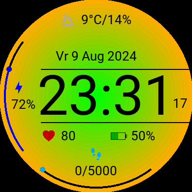
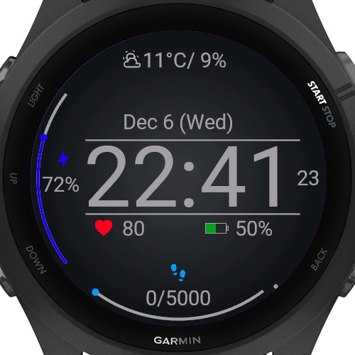
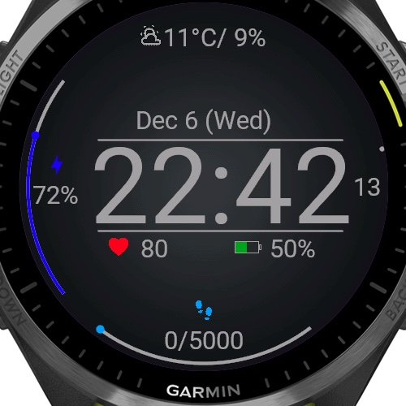

# WatchMyMonkey - WatchFace

An adapted more configurable versions of [SuccessCircle](https://github.com/sura0111/GarminWatchFaceSuccessCircle), see original screenshots below.

## Added Features
- Support for the Forerunner 165
- Support for custom date formatting (see settings)
- Configurable foreground color
- Configurable background
   - None
   - Solid color
   - Gradient color
   - Image (non-configurable)

## Settings
TODO

### Support

## Screenshots

### Forerunner 165

## Original screenshots

### Forerunner 265

### Forrunner 965

